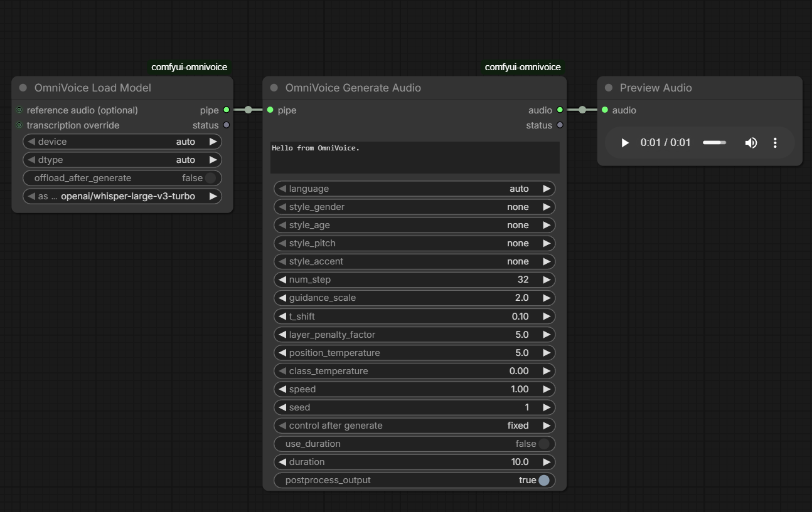

# ComfyUI-OmniVoice

ComfyUI custom node wrapper for [k2-fsa/OmniVoice](https://github.com/k2-fsa/OmniVoice), a multilingual zero-shot TTS model supporting voice cloning, voice design, and automatic voice generation.



## Source

- OmniVoice repo: `https://github.com/k2-fsa/OmniVoice`
- OmniVoice model: `https://huggingface.co/k2-fsa/OmniVoice`

## Features

- Voice cloning via reference audio/transcript prepared in the load node pipe
- Voice design (`instruct` prompt)
- Automatic mode selection based on reference audio presence
- Automatic first-run model download from Hugging Face into Comfy model cache

## Installation

1. Install via **ComfyUI Manager**
   - Search for `ComfyUI-OmniVoice_CRT` and install.

   **OR**

   Clone manually into `ComfyUI/custom_nodes` and install dependencies:

```bash
cd ComfyUI/custom_nodes
git clone https://github.com/PGCRT/ComfyUI-OmniVoice_CRT.git
cd ComfyUI-OmniVoice_CRT
install_omnivoice_safe.bat
```

   The BAT installer auto-detects `python_embeded\\python.exe` and installs:
   - `omnivoice>=0.1.0` with `--no-deps` (prevents Torch/Torchaudio override)
   - `huggingface_hub>=1.3.0,<2.0`

2. Restart ComfyUI.

## Usage Notes

- For voice cloning:
  - connect `reference audio (optional)` (and optional `transcription override`) to `OmniVoice Load Model`
- For voice design:
  - do not connect reference audio
  - set `instruct` (example: `female, low pitch, british accent`), or leave empty for fallback

## Troubleshooting

- **Model download fails**
  - Check internet/Hugging Face access.
- **ASR auto-transcription fails**
  - Connect reference audio to `OmniVoice Load Model` and ensure network access for Whisper model download.

## Not Implemented

- Batch multi-utterance generation in a single node execution (this wrapper generates one output audio at a time).
